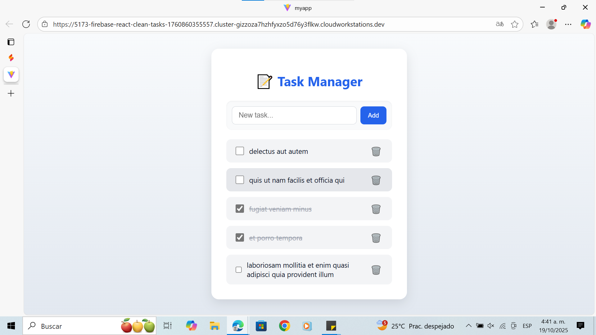
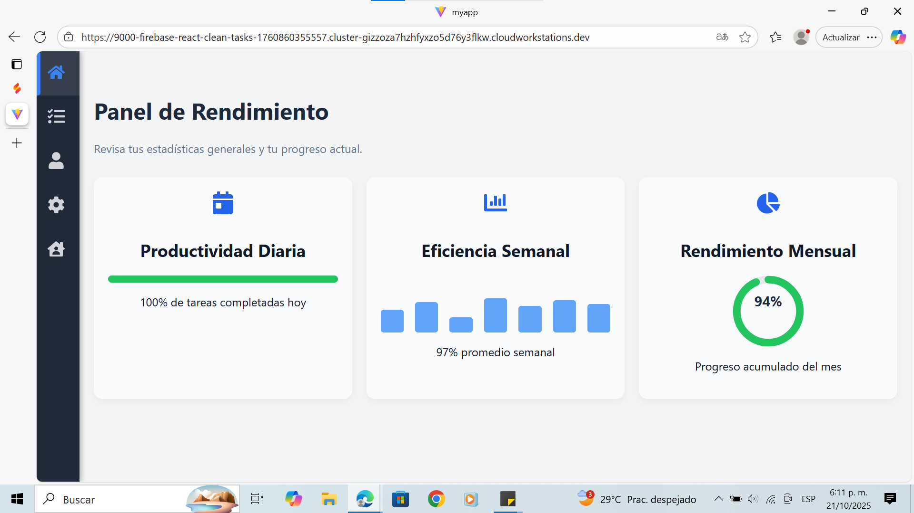
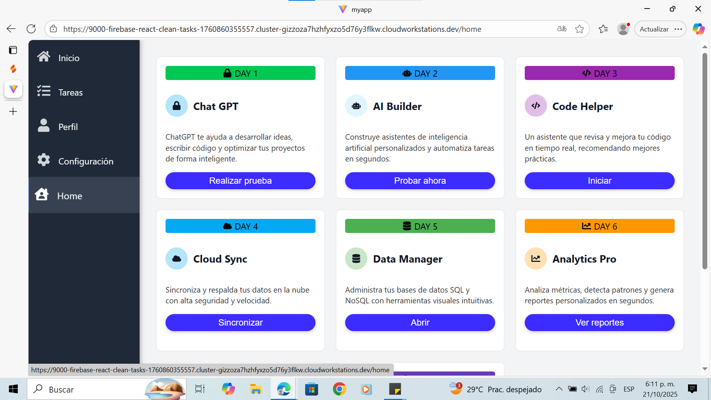

# 🧹 React Clean Tasks

Proyecto de ejemplo para gestionar tareas en React siguiendo buenas prácticas.

---

## 📋 Requisitos

- Node.js 20.19+  
- npm (v8+ recomendado)

---

## ⚙️ Instalación

1. Clona el repositorio:

```bash
git clone https://github.com/tuusuario/react-clean-tasks.git
````

2. Entra al proyecto:

```bash
cd react-clean-tasks
```

3. Instala las dependencias:

```bash
npm install
```

---

## 💻 Ejecutar en modo desarrollo

```bash
npm start
```

Esto abrirá el proyecto en tu navegador en [http://localhost:3000](http://localhost:3000).

---

## 🛠️ Comandos útiles

* Ejecutar pruebas:

```bash
npm test
```

* Construir para producción:

```bash
npm run build
```

---

## 🧩 Dependencias principales

| Paquete     | Descripción                           |
| ----------- | ------------------------------------- |
| **react**   | Librería principal                    |
| **zustand** | Manejo de estado global               |
| **axios**   | Peticiones HTTP                       |
| **clsx**    | Manejo limpio de clases condicionales |
| **vite**    | Bundler rápido y moderno              |

---

## ▶️ Ejecución en desarrollo

```bash
npm run dev
```

El proyecto estará disponible en:
👉 **[http://localhost:5173](http://localhost:5173)**

---

## 🧠 Arquitectura limpia

El proyecto sigue el principio **“Separation of Concerns”**:

* **core/** → Lógica del dominio (entidades, casos de uso, repositorios)
* **data/** → Comunicación con la API (infraestructura)
* **state/** → Estado global con Zustand
* **ui/** → Componentes y pantallas

Esto facilita la escalabilidad y el mantenimiento del código.

---

## 🎨 Interfaz moderna

El diseño se basa en estilos limpios con CSS nativo:

* Transiciones suaves (`transition`, `transform`)
* Sombras (`box-shadow`)
* Layout flexible (`flex`, `gap`, `grid`)
* Modo oscuro con `dark-mode` controlado por CSS

---

## 🧰 Scripts útiles

```bash
npm run dev       # Inicia el servidor de desarrollo
npm run build     # Compila el proyecto para producción
npm run preview   # Vista previa de la build
```

---

## 🤝 Contribución

1. Haz un fork del proyecto
2. Crea una rama (`git checkout -b feature/nueva-funcionalidad`)
3. Haz tus cambios y commitea (`git commit -m 'Añade nueva funcionalidad'`)
4. Sube tu rama (`git push origin feature/nueva-funcionalidad`)
5. Crea un Pull Request 🚀

---

## 📸 Captura del diseño





---

## 📄 Licencia

Este proyecto está bajo la licencia **MIT** — libre para usar, modificar y compartir.

---

**Desarrollado por:** Frank 💻
Con el apoyo de Mateo 🤝

